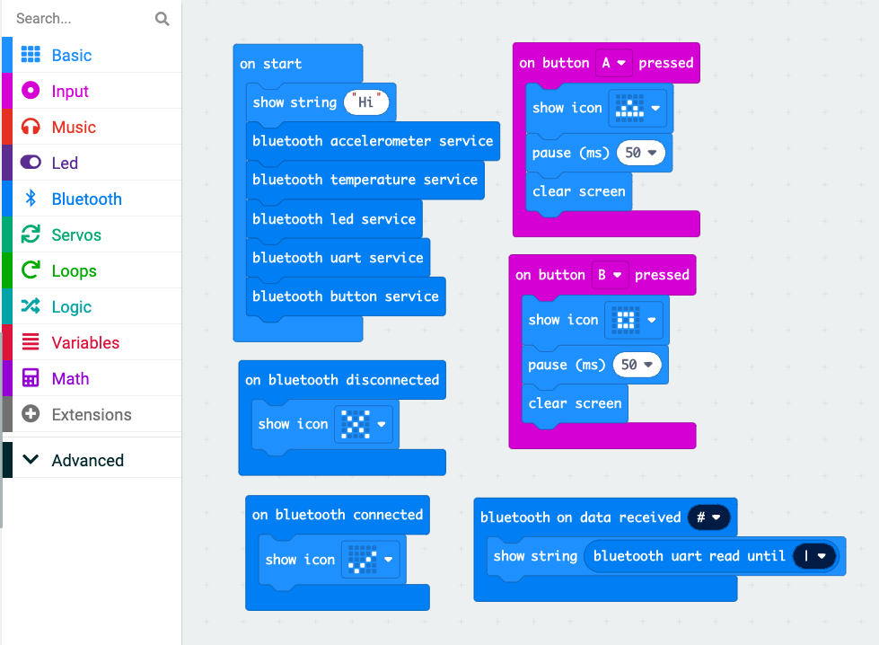

# MicrobitBT - Bluetooth Library for micro:bit

This JavaScript library facilitates communication with the micro:bit microcontroller over Bluetooth, utilizing the Bluetooth Web API. It offers a simple and efficient way to interact with various micro:bit features such as the accelerometer, buttons, and IO pins directly from a web browser.


## Description

The micro:bit Bluetooth Library aims to simplify the development of web applications that interact with the micro:bit. It abstracts the complexities of the Bluetooth Web API and provides an easy-to-use interface for accessing the micro:bit's sensors and actuators. This library is perfect for educators, hobbyists, and developers looking to create interactive web-based projects with the micro:bit.

## Requirements

- A micro:bit microcontroller with firmware that exposes the necessary Bluetooth services. This means you'll need to flash your micro:bit with software that includes these services. 

Below is an example of how you might set up your micro:bit using the MakeCode editor to expose Bluetooth services:



Ensure your micro:bit is flashed with a program like this to facilitate communication with the library.
- A Bluetooth Low Energy (BLE) enabled device for communication.
- A web browser with Bluetooth Web API support, such as the latest versions of Chrome, Edge, or Opera.

## Installation

Include the micro:bit Bluetooth library in your web project by adding the following script tag to your HTML:

```html
<script src="path/to/microbit.js"></script>
```

Usage Examples

Here's a simple example to connect to a micro:bit and read the state of button A:

```javascript
// Initialize the library
const microbit = new Microbit();

// Connect to the micro:bit
microbit.connect().then(() => {
    console.log('Connected to micro:bit');
  
    microbit.on("buttonA", state => {
        console.log(`Button A state: ${state ? 'Pressed' : 'Released'}`);
    });

});

```

Read temperature sensor data:

```javascript
microbit.on("temperature", temp => {
    console.log(`Temperature: ${temp}°C`);
});
```

Read accelerometer data:

```javascript
microbit.on("accelerometer", ({ x, y, z }) => {
    console.log(`Accelerometer: x=${x}, y=${y}, z=${z}`);
});
```

**Check simple canvas game in assets/game.html**

## Support and Contribution

Feedback, bug reports, and contributions are greatly appreciated. If you encounter any issues or have suggestions for improving the library, please feel free to open an issue or submit a pull request on GitHub. Your input helps make this project better for everyone.

If you find this library useful and would like to support its development, consider buying me a coffee. Every coffee bought is a huge motivation for me to continue developing and maintaining this project. You can support me here: [https://buycoffee.to/lkobylski](https://buycoffee.to/lkobylski)

Thank you for your support and contribution!


## License

This project is licensed under the MIT License - see the [LICENSE.md](LICENSE.md) file for details.

MIT License is a permissive license that is short and to the point. It lets people do anything they want with your code as long as they provide attribution back to you and don’t hold you liable.

